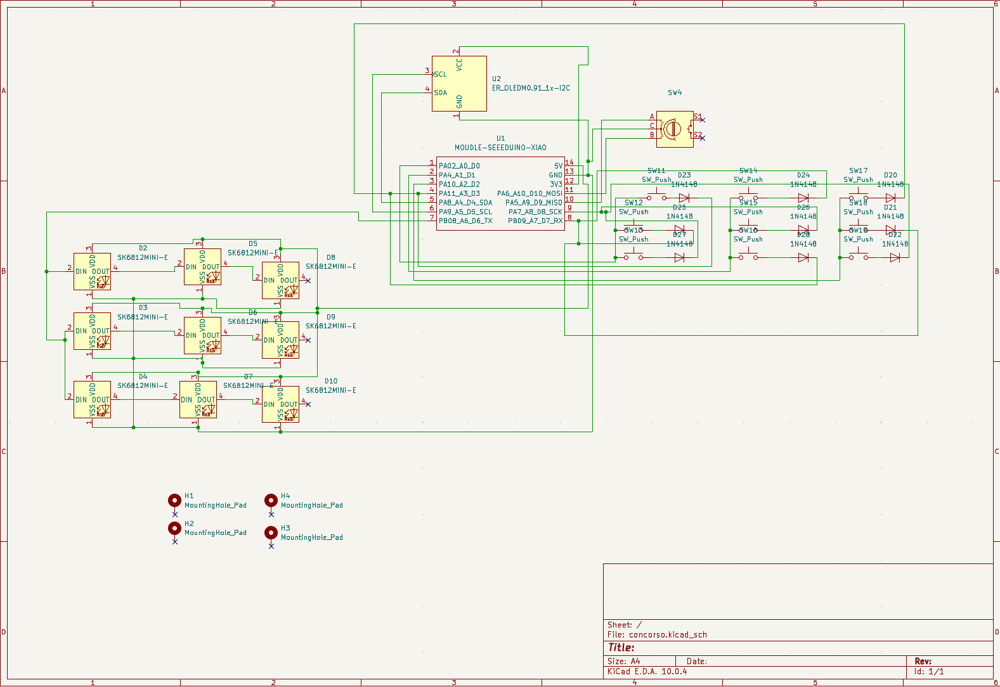
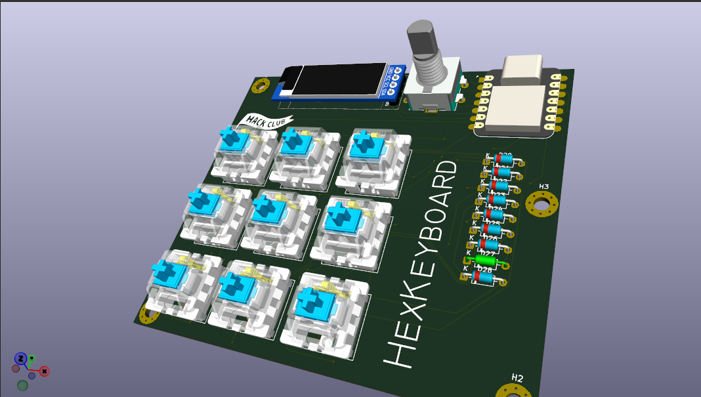
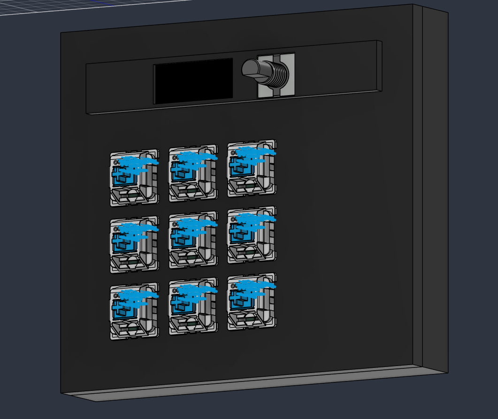

# 9-key macropad + encoder + OLED

Homemade macropad: 9 keys in a 3x3 grid, a rotary encoder, and a 0.91" OLED screen. Every switch has its own RGB LED for backlighting, all chained together on a single data pin.

## Hardware

- Seeed XIAO RP2040
- 0.91 inch OLED display
- Rotary encoder with built-in push button
- 9x MX-Style switches, each with its own 1N4148 diode, 3x3 matrix
- 9x SK6812MINI-E LEDs daisy-chained for per-key backlighting

## Schematic



## PCB



## Case



## BOM

| Qty | Part | Notes |
|---|---|---|
| 1 | Seeed XIAO RP2040 | main MCU |
| 1 | 0.91 inch OLED display | SSD1306 driver |
| 1 | Rotary encoder |
| 9 | Mechanical switches (MX-style) | |
| 9 | SK6812MINI-E RGB LED | daisy-chained backlight |
| 10 | 1N4148 diode | 9 for the key matrix + 1 for the encoder push button |
| 9 | Keycaps | |
| — | Case (top plate + bottom plate) | 3D printed |
| 8 | M3x16mm screws |
| 4 | M3x5x4mm heatset inserts |

## Firmware

Two firmware options are in this repo, pick one:

### QMK (`qmk/`)

Standard QMK build, ARM/SAMD21 target.

```
qmk compile -kb miatastiera -km default
qmk flash -kb miatastiera -km default
```

### KMK (`kmk/`)

CircuitPython + KMK, easier to read/hack on since it's plain Python, no compiling.

1. Flash CircuitPython onto the XIAO (UF2, drag and drop).
2. Install the KMK library and these CircuitPython libraries onto the board: `adafruit_display_text`, `adafruit_displayio_ssd1306`.
3. Copy `kmk/boot.py` and `kmk/code.py` to the root of the CIRCUITPY drive.
4. Reset the board (boot.py only runs on reset/power-up, not on save).

Note: pin names in `kmk/code.py` use `board.D0`, `board.D1`, etc. — same pins as the QMK version, still need to confirm the exact mapping (see below).

## What it does

- 9 programmable keys, multiple layers
- Encoder: turning it forward/back seeks the currently playing track
- Screen: shows the progress bar of whatever track is playing (see below, needs the companion script)
- Per-key RGB backlighting

## The music bar

The firmware alone has no idea what's playing on the PC, it has zero visibility into the OS's media players. To get the real track position on the OLED, a small script needs to run on the computer, read the player's state (Spotify, browser, whatever) and send it to the keyboard over raw HID. That script lives in `host/media_bridge.py`.

If the script isn't running, the encoder still sends seek forward/back commands to the OS, the screen just won't show an updated bar.

## Note

Encoder push button is intentionally disconnected — no free GPIO left to give it its own matrix cell so it's not wired into anything and does nothing in firmware.
