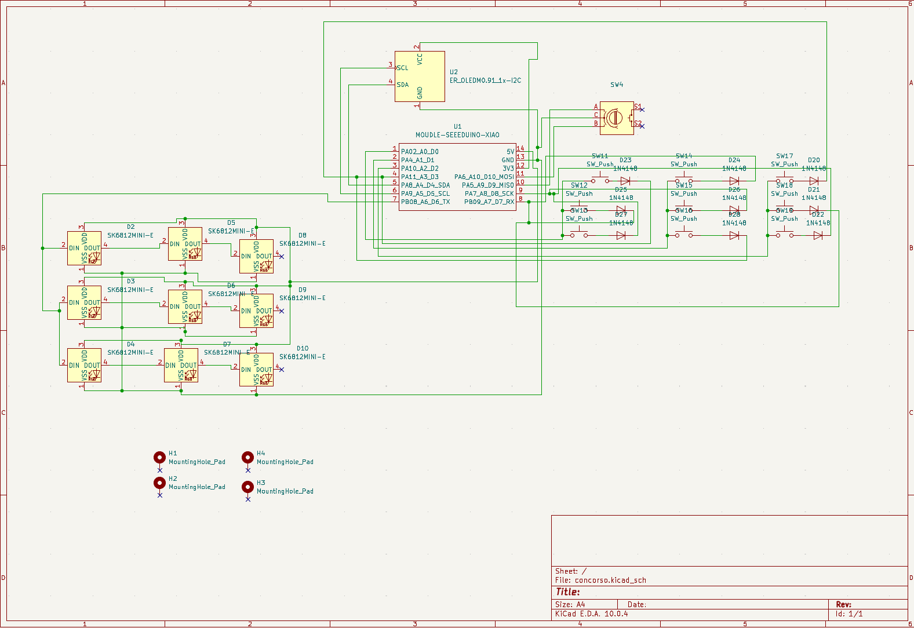
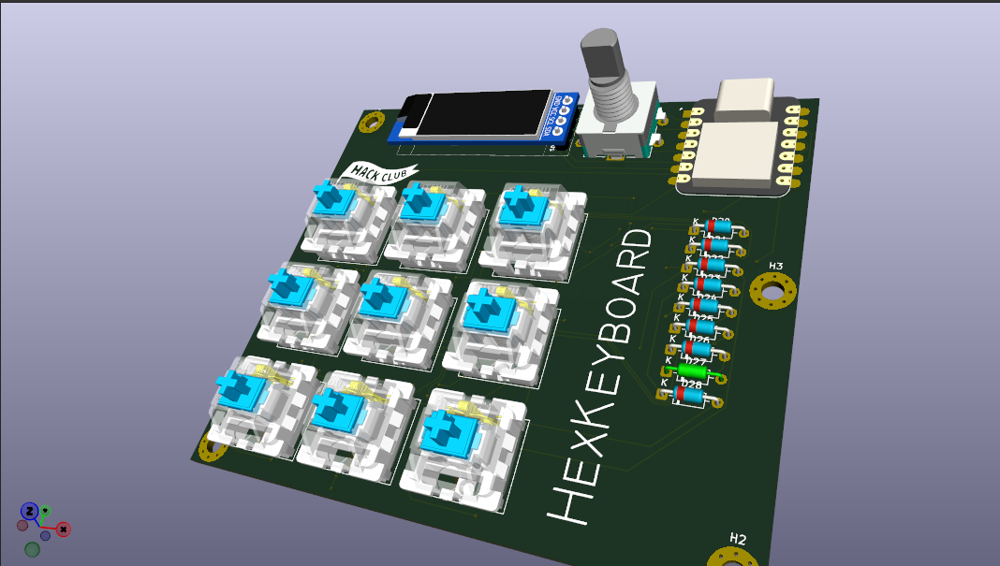
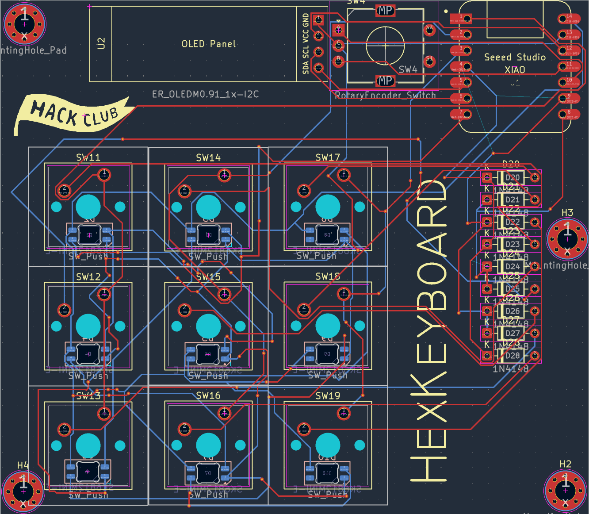
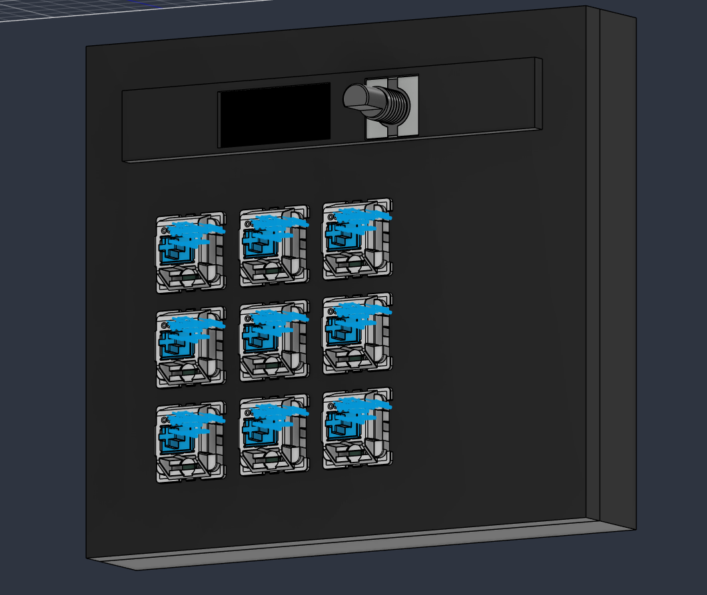
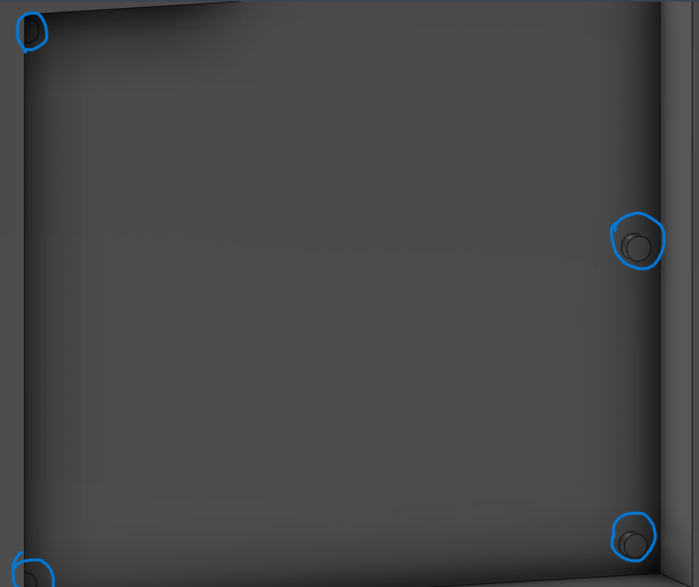

# 9-key macropad + encoder + OLED

Homemade macropad: 9 keys in a 3x3 grid, a rotary encoder, and a 0.91" OLED screen. Every switch has its own RGB LED for backlighting, all chained together on a single data pin.

## Hardware

- Seeed XIAO RP2040
- 0.91 inch OLED display
- Rotary encoder with built-in push button
- 9x MX-Style switches, each with its own 1N4148 diode, 3x3 matrix
- 9x SK6812MINI-E LEDs daisy-chained for per-key backlighting

## Schematic

## PCB Render

## PCB

## Case

## Case Heated Inserts

You can put heated inserts in the highlited zones and then screw the pcb in 

## BOM

| Qty | Part | Notes |
|---|---|---|
| 1 | Seeed XIAO RP2040 | main MCU |
| 1 | 0.91 inch OLED display | SSD1306 driver |
| 1 | Rotary encoder |
| 9 | Mechanical switches (MX-style) | |
| 9 | SK6812MINI-E RGB LED | daisy-chained backlight |
| 10 | 1N4148 diode | 9 for the key matrix + 1 for the encoder push button |
| 9 | Keycaps | |
| — | Case (top plate + bottom plate) | 3D printed |
| 8 | M3x16mm screws |
| 4 | M3x5x4mm heatset inserts |

## Firmware 

1. Flash CircuitPython onto the XIAO
2. Clone the KMK library (github.com/KMKfw/kmk_firmware) and copy its kmk/ folder onto the CIRCUITPY drive. Also install these CircuitPython libraries onto the board: adafruit_display_text, adafruit_displayio_ssd1306.
3. Copy boot.py and code.py to the root of the CIRCUITPY drive.
4. Reset the board (boot.py only runs on reset/power-up, not on save).

## What it does

- 9 programmable keys
- Encoder: function described below
- Screen: shows the progress bar of whatever track is playing 
- Per key RGB backlighting

## The music bar
 
I implemented a feature called music bar, if you are playing something in the background the duration of the media is showed on the display and you can controll it with the encoder. If you want to use this function you need to run the .py program in the firmware folder because otherwise the microcontroller doesn't know what is the device playing

## Note

The push button of the encoder is intentionally disconnected because there were no pins left on the microcontroller to connect it 